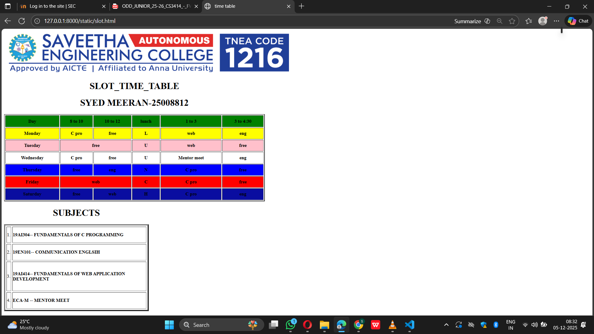

# Ex02 Time Table
## Date:27/11/2025

## AIM
To write a html webpage page to display your slot timetable.

## ALGORITHM
### STEP 1
Create a Django-admin Interface.

### STEP 2
Create an App inside the Django project.

### STEP 2
Create a static folder uder the created App and insert HTML code.

### STEP 3
Create a simple table using ```<table>``` tag in html with the relevant attributes.

### STEP 4
Add rows using ```<tr>``` tag.

### STEP 5
Add your course schedule using ```<td>``` tag.

### STEP 6
Execute the program using runserver command.

## PROGRAM
```
<html>
 
    <head>
        
        <title>time table </title>
    </head>
    <body>
        
        <table width="900" height="300" border="3" cellspacing="3"><caption><h1 align="center"><B>SLOT_TIME_TABLE</B> </h1><h1><b>SYED MEERAN-25008812</b></h1></caption>
            
            <tr bgcolor="green">
            <td align="center"><b>Day </b></td>
            <td align="center"><b>8 to 10 </b></td>
            <td align="center"><b>10 to 12</b></td>
            <td align="center"><b>lunch</b></td>
            <td align="center"><b>1 to 3</b></td>
            <td align="center"><b>3 to 4:30</b></td>
        </tr>
        <tr bgcolor="yellow">
            <td align="center"><b>Monday</b></td>
            <td align="center"><b>C pro</b></td>
            <td colspan="1"  align="center"><b>free</b></td>
            <td align="center"><b>L</b></td>
            <td align="center"><b>web</b></td>
            <td align="center"><b>eng</b></td>

        </tr>
        <tr bgcolor="pink">
            <td align="center"><b>Tuesday</b></td>
            <td colspan="2" align="center"><b>free</b></td>
            <td align="center"><b>U</b></td>
            <td align="center"v><b>web</b></td>
            <td align="center"><b>free</b></td>
        </tr>
        <tr bgcolor="white">
            <td align="center"><b>Wednesday</b></td>
            <td align="center" align="center"><b>C pro</b></td>
            <td align="center"><b>free</b></td>
            <td align="center"><b>U</b></td>
            <td align="center"><b>Mentor meet</b></td>
            <td align="center"><b>eng</b></td>
        </tr>
        <tr bgcolor="blue">
            <td align="center"><b>Thursday</b></td>
            <td align="center"><b>free</b></td>
            <td align="center"><b>eng</b></td>
            <td align="center"><b>N</b></td>
            <td align="center"><b>C pro</b></td>
            <td align="center"><b>free</b></td>
        </tr>
        <tr bgcolor="red">
            <td align="center"><b>Friday</b></td>
            <td colspan="2" align="center"><b>web</b></td>
            <td align="center"><b>C</b></td>
            <td align="center"><b>C pro</b></td>
            <td align="center"><b>free</b></td>
        </tr>
        <tr bgcolor="sandal">
            <td align="center"><b>Saturday</b></td>
            <td align="center"><b>free</b></td>
            <td align="center"><b>web</b></td>
            <td align="center"><b>H</b></td>
            <td align="center"><b>C pro</b></td>
            <td align="center"><b>eng</b></td>

        </tr>
        </table>
        <table  width="500"  height="300" border="5" cellspacing="5" ><caption><h1>SUBJECTS</h1></caption>
            <tr>
            <td>1.</td>
            <td><b>19AI304-- FUNDAMENTALS OF C PROGRAMMING</b></td>
            </tr>
            <tr>
                <td>2.</td>
                <td><b>19EN101-- COMMUNICATION ENGLSIH</b></td>
            </tr>
            <tr>
                <td>3.</td>
                <td><b>19AI414-- FUNDAMENTALS OF WEB APPLICATION DEVELOPMENT</b></td>
            </tr>
            <tr>
                <td>4.
                </td>
                <td><b>ECA-M -- MENTOR MEET</b></td>
            </tr>
        
        
        </table>
        
    </body>

</html>
```

## OUTPUT


## RESULT
The program for creating slot timetable using basic HTML tags is executed successfully.
